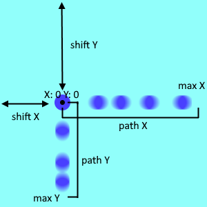

# littleLib
lib with simply functions

## Lib file
typescript:
littleLib/ts/littleLib.ts

javascript:
littleLib/docs/out/littleLib.js

## Usage
``` ts
import * as Lib from "./littleLib.js"
```
### Get Html element
function                  | arguments  | return
--------------------------|------------|---------------
Lib.get.div               | id: string | HTMLDivElement
Lib.get.button            | id: string | HTMLButtonElement
Lib.get.canvas            | id: string | HTMLCanvasElement
Lib.get.input             | id: string | HTMLInputElement


### Canvas functions
function                          | arguments                                                       | return
----------------------------------|-----------------------------------------------------------------|-----------------
Lib.canvas.getContext2d           | canvas: HTMLCanvasElement                                       | CanvasRenderingContext2D
Lib.canvas.fitToParent.BCR        | canvas: HTMLCanvasElement                                       |
Lib.canvas.fitToParent.ClientWH   | canvas: HTMLCanvasElement                                       |
Lib.canvas.drawGrid               | ctx: CanvasRenderingContext2D, cellSize: number, color?: string |
Lib.canvas.drawCoords             | ctx: CanvasRenderingContext2D, x: number, y: number             |


### Intersection test functions
function                        | arguments                          | return
--------------------------------|------------------------------------|---------------
Lib.intersection.rectPoint      | rect: IRect, point: IPoint         | boolean
Lib.intersection.rects          | rect1: IRect, rect2: IRect         | boolean
Lib.intersection.circlePoint    | circle: ICircle, point: IPoint     | boolean
Lib.intersection.circles        | circle1: ICircle, circle2: ICircle | boolean

#### IPoint:
parameter | type
----------|--------
x	        | number
y	        | number

#### IRect:
parameter | type
----------|--------
x	        | number
y	        | number
width     | number
height    | number

#### ICircle:
parameter | type
----------|--------
x	        | number
y	        | number
r	        | number

### Get random values
function                  | arguments                    | return
--------------------------|------------------------------|---------------
Lib.random.int            | bound: number                | 0 >= number < bound
Lib.random.intFrom        | start: number, bound: number | start >= number < bound
Lib.random.boolean        |                              | boolean
Lib.random.asbOrNot       | num: number                  | num or -num


### Other functions
function                  | arguments                              | return
--------------------------|----------------------------------------|---------------
Lib.square                | num: number                            | num * num
Lib.loadScript            | scriptPath: string                     |
Lib.addButtonListener     | id: string, f: (e: MouseEvent) => void |

### HTML build
function                  | return
--------------------------|---------------
Lib.Div                   | HTMLDivElement
Lib.Span                  | HTMLSpanElement
Lib.H1                    | HTMLHeadingElement

#### Arguments
function                  | type
--------------------------|--------------------
classes                   | string[] \| string
children                  | HTMLElement[]
innerText                 | string

function                  | arguments | return
--------------------------|-----------|---------------
Lib.Input                 | classes?: string[] \| string, type?: string, placeholder?: string      | HTMLInputElement
Lib.Button                | classes?: string[] \| string, innerText?: string, clickListener?: (btn: HTMLButtonElement) => void     | HTMLButtonElement

### Move animator
``` ts
const moveAnimator =  new Lib.MoveAnimator(x, y, shiftX, shiftY, maxX, maxY, stepX, stepY);
```
#### Constructor:
argument    | type
------------|-------
x           | number
y           | number
shiftX      | number
shiftY      | number
maxX        | number
maxY        | number
stepX       | number \| (() => number)
stepY       | number \| (() => number)

#### Methods:
method          | arguments      | return
----------------|----------------|-----------
X               |                | x + shiftX
Y               |                | y + shiftY
nextX           | step?: number  | x + shiftX
nextY           | step?: number  | y + shiftY
nextBounceX     | step?: number  | x + shiftX
nextBounceY     | step?: number  | y + shiftY




### Point
``` ts
const point = new Lib.Point(x: number, y: number);
```

#### Methods:
method          | arguments                     | return
----------------|-------------------------------|-----------
intersectRect   | rect: IRect                   | boolean
intersectCircle | circte: ICircle               | boolean
fill          	| ctx: CanvasRenderingContext2D |
stroke          | ctx: CanvasRenderingContext2D |
copy          	|                               | Point
getPoint        |                               | Point


### Rect
``` ts
const rect = new Lib.Rect(x: number, y: number, width: number, height: number);
const rect = new Lib.Rect.Create(point: IPoint, width: number, height: number);
const rect = new Lib.Rect.Create2(point: IPoint, point2: IPoint);
```

#### Methods:
method          | arguments                     | return
----------------|-------------------------------|-----------
intersectRect   | rect: IRect                   | boolean
intersectPoint  | point: IPoint                 | boolean
fill          	| ctx: CanvasRenderingContext2D |
stroke          | ctx: CanvasRenderingContext2D |
copy          	|                               | Rect
getPoint        |                               | Point


### Circle
``` ts
const rect = new Lib.Circle(x: number, y: number, r: number);
const rect = new Lib.Circle.Create(point: IPoint, r: number);
```

#### Methods:
method          | arguments                     | return
----------------|-------------------------------|-----------
intersectCircle | circte: ICircle               | boolean
intersectPoint  | point: IPoint                 | boolean
fill          	| ctx: CanvasRenderingContext2D |
stroke          | ctx: CanvasRenderingContext2D |
copy          	|                               | Circle
getPoint        |                               | Point

### IFigure
parameter | type
----------|------
fill      |(ctx: CanvasRenderingContext2D) => void,
stroke    |(ctx: CanvasRenderingContext2D) => void,
copy      |() => IFigure,
getPoint  |() => Point,